# 💫 About Me:
FullStack SWE & Data Science/Analyst Student @ Forward College    Currently working on internship @ Consurv Technic Sdn Bhd   -> horology. -> tech. -> motorsport. -> fitness. -> fashion.  you deserve a better browser: https://arc.net/gift/9a2bef54 <3  

## 🌐 Socials:
   

# 💻 Tech Stack:

| Category | Tools |
| :--- | :--- |
| **Languages** |         |
| **Frontend** |           |
| **Backend** |        |
| **Mobile** |   |
| **Database/Cloud** |        |
| **AI / Data Science** |          |
| **Tools/Other** |          |

# 📈 Metrics

### Overview

### Commit Calendar

### Languages

### Code Stats

### Repositories

### Issues & PRs

### People

